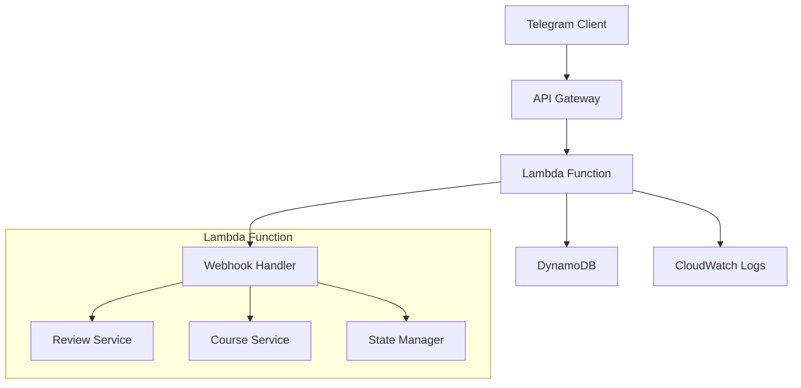

# Design Document

## Overview

The PickYourCourses Telegram bot is designed as a serverless application running on AWS Lambda with a webhook-based architecture. The system uses DynamoDB for data persistence and implements a state machine pattern for managing user interactions. The bot provides a comprehensive course review system with rating capabilities.

## Architecture

### High-Level Architecture



### Deployment Architecture

- **API Gateway**: Receives webhook calls from Telegram
- **Lambda Function**: Processes bot commands and manages business logic
- **DynamoDB**: Stores reviews, courses, and session state
- **CloudWatch**: Logging and monitoring

## Components and Interfaces

### 1. Webhook Handler

**Purpose**: Entry point for all Telegram messages and callbacks

**Key Methods**:

- `handleWebhook(event)`: Main handler for incoming requests
- `parseUpdate(update)`: Extracts message/callback data
- `routeCommand(command, user, data)`: Routes to appropriate service

**Interfaces**:

```typescript
interface TelegramUpdate {
  message?: Message;
  callback_query?: CallbackQuery;
  update_id: number;
}

interface WebhookResponse {
  statusCode: number;
  body: string;
}
```

### 2. Review Service

**Purpose**: Handles course review creation, retrieval, and voting

**Key Methods**:

- `createReview(userId, courseId, ratings, text, anonymous)`: Creates new review
- `getReviews(courseId, sortBy)`: Retrieves reviews for a course
- `voteReview(userId, reviewId, voteType)`: Handles upvote/downvote
- `updateReview(userId, reviewId, newData)`: Updates existing review

**Rating System**:

- Overall Rating: 1-5 stars
- Quality Rating: 1-5 stars  
- Difficulty Rating: 1-5 stars
- Stored as integers, displayed as emoji stars

### 3. Course Service

**Purpose**: Manages course data and categorization

**Key Methods**:

- `getCoursesByCategory(category)`: Returns courses in category
- `getCourseDetails(courseId)`: Returns course info and average ratings
- `updateGradingScheme(courseId, scheme, userId)`: Updates grading info
- `getGradingHistory(courseId)`: Returns grading scheme history

**Course Categories**:

- Page 1: MAA, PHY, CSE, ECO, LAB
- Page 2: HSS, PDV, BIO, CHEM, SPOFAL, PRL

### 4. State Manager

**Purpose**: Manages conversation state and user navigation

**Key Methods**:

- `setState(userId, state, data)`: Sets user's current state
- `getState(userId)`: Retrieves current user state
- `clearState(userId)`: Resets user state
- `handleTimeout(userId)`: Manages session timeouts

**State Types**:

- MAIN_MENU
- BROWSING_CATEGORIES
- VIEWING_COURSE
- POSTING_REVIEW

### 5. Rate Limiting Service

**Purpose**: Prevents spam and abuse by limiting user message frequency

**Key Methods**:

- `checkRateLimit(userId)`: Validates if user can send message
- `incrementMessageCount(userId)`: Records new message
- `getDailyCount(userId)`: Returns today's message count
- `getTotalCount(userId)`: Returns lifetime message count

**Rate Limits**:

- Daily limit: 200 messages per user per day
- Total limit: 1000 messages per user lifetime
- Limits reset at midnight UTC for daily counter

## Data Models

### Course Model

```typescript
interface Course {
  courseId: string;             // Primary key (e.g., "MAA101")
  category: string;             // MAA, PHY, CSE, etc.
  name: string;
  description?: string;
  gradingScheme: GradingScheme;
  averageRatings: {
    overall: number;
    quality: number;
    difficulty: number;
  };
  reviewCount: number;
}
```

### Review Model

```typescript
interface Review {
  reviewId: string;             // Primary key
  courseId: string;             // GSI
  userId: string;
  ratings: {
    overall: number;            // 1-5
    quality: number;            // 1-5
    difficulty: number;         // 1-5
  };
  text?: string;
  anonymous: boolean;
  upvotes: number;
  downvotes: number;
  createdAt: string;
  updatedAt: string;
  isDeleted: boolean;
}
```

### Vote Model

```typescript
interface Vote {
  voteId: string;               // Primary key
  reviewId: string;             // GSI
  userId: string;
  voteType: 'up' | 'down';
  createdAt: string;
}
```

### Session Model

```typescript
interface Session {
  userId: string;               // Primary key
  state: string;
  data?: any;                   // Context data for current state
  lastActivity: string;
  expiresAt: string;
}
```

### Grading Scheme Model

```typescript
interface GradingScheme {
  components: Array<{
    name: string;               // e.g., "Midterm", "Final", "Homework"
    percentage: number;         // Must sum to 100
  }>;
  lastModified: string;
  modifiedBy: string;           // User ID for audit trail
}
```

### Rate Limit Model

```typescript
interface RateLimit {
  userId: string;               // Primary key
  dailyCount: number;           // Messages sent today
  totalCount: number;           // Lifetime message count
  lastResetDate: string;        // Date of last daily reset (YYYY-MM-DD)
  lastMessageTime: string;      // Timestamp of last message
}
```

## Error Handling

### Review Errors

- Duplicate review → Offer to update existing review
- Invalid rating values → Prompt for valid 1-5 range
- Missing required fields → Highlight specific missing data

### System Errors

- DynamoDB failures → Retry with exponential backoff
- Telegram API errors → Log and provide user-friendly message

### Rate Limiting Errors

- Daily limit exceeded → Inform user of daily limit and reset time
- Total limit exceeded → Inform user they've reached lifetime limit
- Rapid messaging → Implement brief cooldown period

### Timeout Handling

- 10-minute warning → Send reminder message
- 15-minute timeout → Clear session
- Lambda timeout → Implement graceful degradation

## Testing Strategy

### Unit Testing

- **Review Service**: Test rating calculations, vote handling, review CRUD operations
- **Course Service**: Test category filtering, average rating calculations
- **State Manager**: Test state transitions and timeout handling

### Integration Testing

- **DynamoDB Integration**: Test all database operations with local DynamoDB
- **Telegram API**: Test webhook handling and message sending

### End-to-End Testing

- **Review Workflow**: Post review → View review → Vote on review
- **Navigation**: Test all menu transitions and back buttons

### Load Testing

- **Concurrent Users**: Test 100 simultaneous users
- **Database Performance**: Test query performance with large datasets
- **Lambda Cold Starts**: Measure and optimize startup time

### Security Testing

- **Input Validation**: Test SQL injection, XSS prevention
- **Rate Limiting**: Test protection against spam/abuse
- **Data Privacy**: Verify anonymous reviews don't leak user info

## Deployment Configuration

### Lambda Configuration

- **Runtime**: Node.js 18.x
- **Memory**: 512 MB (adjustable based on performance)
- **Timeout**: 30 seconds
- **Environment Variables**:
  - TELEGRAM_BOT_TOKEN
  - DYNAMODB_TABLE_PREFIX

### DynamoDB Tables

- **Courses**: Provisioned capacity for predictable access patterns
- **Reviews**: GSI on courseId for efficient course-based queries
- **Votes**: GSI on reviewId for vote aggregation
- **Sessions**: TTL enabled for automatic cleanup

### API Gateway Configuration

- **Webhook Endpoint**: POST /webhook
- **Request Validation**: Telegram signature verification
- **Rate Limiting**: 1000 requests per minute per IP
- **CORS**: Disabled (not needed for webhook)

### Monitoring and Alerts

- **CloudWatch Metrics**: Lambda duration, error rate, DynamoDB throttles
- **Alarms**: High error rate, long response times
- **Dashboards**: Real-time bot usage, review activity, system health
